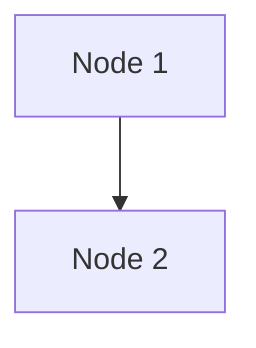
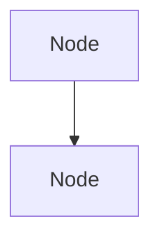

# Diagrams - Home Library Service Architecture

Zbiór szczegółowych diagramów Mermaid dokumentujących architekturę, przepływy i strukturę aplikacji **Home Library Service** (NestJS).

## 📋 Lista Diagramów

### 1. **Architecture Overview** (`1-architecture-overview.mmd`)
Globalny przegląd struktury aplikacji:
- **Węzły główne:** AppModule, UsersModule, AuthModule, PrismaModule, itp.
- **Warstwa bazy danych:** SQLite z Prisma ORM
- **Środki bezpieczeństwa:** ValidationPipe, JwtAuthGuard
- **Dokumentacja:** Swagger/OpenAPI dostępna na `/doc`

**Użyteczne do:** Zrozumienia ogólnej struktury projektu, relacji między modułami, stosu technologicznego.

---

### 2. **Authentication Flow** (`2-auth-flow.mmd`)
Szczegółowy przepływ sekwencji dla autentykacji:

#### Operacje:
1. **SIGNUP** — Rejestracja nowego użytkownika
   - Walidacja danych
   - Zapis w bazie danych
   - Zwrot użytkownika bez hasła

2. **LOGIN** — Logowanie użytkownika
   - Weryfikacja loginu i hasła
   - Generowanie `accessToken` (1 godzina)
   - Generowanie `refreshToken` (7 dni)

3. **REFRESH TOKEN** — Odświeżanie tokena dostępu
   - Weryfikacja refreshToken
   - Generowanie nowego accessToken
   - Obsługa błędów (token wygasły/nieprawidłowy)

4. **PROTECTED ENDPOINT ACCESS** — Dostęp do chronionych endpointów
   - Weryfikacja JWT w nagłówku `Authorization: Bearer`
   - Jeśli token ważny → dostęp do zasobu
   - Jeśli token nieprawidłowy → 401 Unauthorized

**Użyteczne do:** Zrozumienia mechanizmu autentykacji JWT, flow logowania, obsługi tokenów.

---

### 3. **Database Schema** (`3-database-schema.mmd`)
Diagram encji-relacji (ER) bazy danych:

#### Modele:
- **User** — Użytkownik (login, password, version, createdAt, updatedAt)
- **Artist** — Artysta (name, grammy)
- **Album** — Album (name, year, artistId)
- **Track** — Utwór (name, duration, artistId, albumId)
- **Favorites** — Ulubione (relacje M:N do Artist, Album, Track)

#### Relacje:
- Artist → Album (1:M)
- Artist → Track (1:M)
- Album → Track (1:M)
- Favorites → Artist, Album, Track (M:N)

**Użyteczne do:** Zrozumienia struktury danych, relacji między tabelami, designu schematu Prisma.

---

### 4. **Favorites Flow** (`4-favorites-flow.mmd`)
Szczegółowy przepływ operacji na ulubionych (Favorites):

#### Operacje:
1. **GET /favorites** — Pobranie wszystkich ulubionych
   - Jeśli istnieje → zwrot obiektu z tablicami
   - Jeśli nie istnieje → zwrot pustych tablic

2. **POST /favorites/artist/:id** — Dodanie artysty do ulubionych
   - Walidacja UUID
   - Sprawdzenie istnienia artysty → 422 Unprocessable Entity
   - Utworzenie/aktualizacja rekordu Favorites
   - Relacja M:N w bazie

3. **DELETE /favorites/artist/:id** — Usunięcie artysty z ulubionych
   - Walidacja UUID
   - Sprawdzenie istnienia w ulubionych → 404 Not Found
   - Usunięcie relacji M:N

*Analogicznie dla Album i Track.*

**Użyteczne do:** Zrozumienia logiki Favorites, obsługi błędów (400, 404, 422), relacji M:N w Prisma.

---

### 5. **REST Endpoints** (`5-rest-endpoints.mmd`)
Mapa wszystkich REST endpointów aplikacji z kolorami semantycznymi:

#### Grupy endpointów:
- **Auth (Publiczne)** — `/auth/signup`, `/auth/login`, `/auth/refresh`
- **Artists (Publiczne)** — CRUD na artystach
- **Albums (Publiczne)** — CRUD na albumach
- **Tracks (Chronione JWT)** — CRUD na utworach
- **Users** — Operacje na użytkownikach
- **Favorites** — Dodawanie/usuwanie z ulubionych
- **Documentation** — `/doc` (Swagger)

#### Kody statusu:
- `200 OK` — Sukces GET/PUT
- `201 Created` — Sukces POST
- `204 No Content` — Sukces DELETE
- `400 Bad Request` — Invalid UUID/input
- `401 Unauthorized` — Brak/invalid JWT
- `403 Forbidden` — Brak uprawnień
- `404 Not Found` — Zasób nie znaleziony
- `422 Unprocessable Entity` — Encja nie istnieje (np. artysta w Favorites)

**Użyteczne do:** Dokumentacji API, testowania endpointów, zrozumienia wymagań autoryzacji.

---

### 6. **Request Lifecycle** (`6-request-lifecycle.mmd`)
Pełny przepływ żądania HTTP przez aplikację:

#### Etapy:
1. **HTTP Request** — Przychodzące żądanie
2. **ValidationPipe** — Walidacja DTO (whitelist, transform, forbidNonWhitelisted)
3. **Route Matching** — Routing żądania do kontrolera
4. **Guard Execution** — Sprawdzenie @Public() dekoratora i JWT
5. **Controller Method** — Wyodrębnienie i powiązanie DTO
6. **Service Layer** — Logika biznesowa i walidacja
7. **Database** — Zapytania Prisma
8. **Response Construction** — Zbudowanie odpowiedzi (success/error)
9. **HTTP Response** — Wysłanie do klienta

**Użyteczne do:** Debugowania żądań, zrozumienia sekwencji walidacji, obsługi błędów.

---

### 8. **Branch Comparison: develop vs develop-q4** (`8-branch-comparison-develop-vs-develop-q4.mmd`)
Kompleksowe porównanie zmian między branchami `develop4` a `develop-q4`:

#### Zawartość:
- **Commits & History** — Historia commitów w obu branchach
- **Statistics** — 49 zmian plików: 25 modyfikacje, 15 dodane, 6 usunięte, 3 przeniesione
- **Architecture Changes** — Zmiana z in-memory na Prisma + SQLite
- **Folder Structure** — Rename `user/` → `users/`, nowe foldery `prisma/` i `scripts/`
- **Key Changes** — Dodane: Prisma, migrations, skrypty; Usunięte: auth.service, stare DTOs
- **Module Dependencies** — Dodanie PrismaModule do systemu

**Użyteczne do:** Wysokopoziomowego przeglądu wszystkich zmian, przygotowania do migracji.

---

### 9. **File-Level Changes** (`9-file-level-changes-develop-vs-develop-q4.mmd`)
Szczegółowy diagram zmian na poziomie plików:

#### Struktura:
- **Database & ORM Layer** — Od braku Prisma do pełnej integracji
- **Auth Module** — Usunięcie auth.service.ts, przeniesienie logiki do kontrolera
- **Users Module** — Rename `user/` → `users/`, refaktoring serwisu
- **Artists/Albums/Tracks** — Integracja Prisma, zmiana na Prisma queries
- **Favorites Module** ⭐ — Największa zmiana (+333 linii), rewrite z in-memory na Prisma M:N
- **Configuration** — Aktualizacje package.json, .env, README

**Użyteczne do:** Detaillowej analizy każdego modułu, planu migracji kodu.

---

### 10. **Service Layer Evolution** (`10-service-layer-evolution.mmd`)
Wizualizacja ewolucji serwisów od in-memory do Prisma:

#### Aspekty:
- **Each Service** — Porównanie przed/po dla każdego serwisu (Users, Auth, Artists, Albums, Tracks, Favorites)
- **Favorites Evolution** ⭐ — Szczegółowa zmiana (333 linii), M:N relacje, error handling
- **Common Pattern** — Unifikacja wzorca Prisma we wszystkich serwisach
- **Data Flow** — Zmiana z in-memory array na SQLite + Prisma

**Użyteczne do:** Zrozumienia zmian w logice biznesowej, wzorców Prisma, typów danych.

---

### 11. **Test & CI/CD Improvements** (`11-test-and-ci-cd-improvements.mmd`)
Zmiany w testowaniu i automatyzacji:

#### Zawartość:
- **Test Infrastructure** — Od minimalnego do production-grade setup
- **Test Setup File** — `test/setup.ts` (78 linii) z helperami do testów
- **Scripts Added** — Nowe skrypty: `start-server.ts`, `run-tests.ts`, `check-app.ts`
- **Test Configuration** — `jest-e2e.json` dla konfiguracji E2E testów
- **E2E Tests** — Pełna pokrycie autoryzacji, CRUD, error scenarios
- **CI/CD Integration** — Gotowość do GitHub Actions, GitLab CI, Jenkins
- **Error Scenarios** — Nowe testy dla 400, 404, 422, 401, 403 kodów

**Użyteczne do:** Zrozumienia testów, setup CI/CD, integracji z DevOps pipeline.

---

### 7. **Module Dependencies** (`7-module-dependencies.mmd`)
Diagram iniekcji zależności (DI) i struktury modułów:

#### Komponenty:
- **AppModule** — Root moduł importujący wszystkie feature modules
- **UsersModule** → UsersController, UsersService
- **AuthModule** → AuthController, JwtStrategy, JwtAuthGuard (zależy od UsersModule)
- **PrismaModule** → PrismaService (eksportowany, używany przez inne serwisy)
- **ArtistsModule**, **AlbumsModule**, **TracksModule**, **FavoritesModule** → każdy z własnym kontrolerem i serwisem

#### Zakresy:
- `@Module()` — definicja modułu
- `imports` — moduły/dostawcy zaimportowani
- `controllers` — kontrolery w module
- `providers` — serwisy/straże/strategie
- `exports` — eksportowane dla innych modułów

**Użyteczne do:** Zrozumienia DI, struktury modułów, zależności między serwisami.

---

## 🎨 Konwencje Kolorów

| Kolor | Znaczenie |
|-------|-----------|
| 🔵 Niebieski | Core modules, global structures |
| 🟢 Zielony | Services, business logic |
| 🟠 Pomarańczowy | Auth, security (JWT, strategies) |
| 🟡 Żółty | Data transformation, validation |
| 🔴 Czerwony | Database, errors, Prisma |
| 🟣 Fioletowy | Middleware, guards, utilities |
| ⚪ Jasny | DTOs, interfaces, data structures |

---

## 📖 Jak czytać diagramy

### Diagram orientacyjny (Graph TB = Top-Bottom)
```
   ┌─────────────┐
   │  AppModule  │
   └──────┬──────┘
          │
    ┌─────┴──────┐
    │             │
 ┌──▼──┐    ┌────▼───┐
 │Auth │    │ Users  │
 └─────┘    └────────┘
```

### Diagram sekwencyjny (Sequence)
```
Client ──POST──► Controller ──► Service ──► Database
              │                 │           │
              └─── Response ────┘           │
                                │           │
                                └─ Query ──┘
```

### Diagram ER (Entity-Relationship)
```
User ||--o{ Artist : "creates"
       │    │
       │    └─────┐
       │          │
     Album ◄──┘   Track
```

---

## 🔍 Porównanie Branchów (develop4 vs develop-q4)

### Statystyka Zmian

| Metrika | Wartość |
|---------|---------|
| Liczba commitów w develop-q4 | 2 nowe |
| Liczba commitów w develop4 | 10 nowych |
| Zmienione pliki | 49 |
| Modyfikacje (M) | 25 |
| Dodane pliki (A) | 15 |
| Usunięte pliki (D) | 6 |
| Przeniesione pliki (R) | 3 |
| Wstawiania | +1325 |
| Usunięcia | -1004 |

### Główne Różnice

| Aspekt | develop4 | develop-q4 |
|--------|----------|-----------|
| **Baza Danych** | In-memory | SQLite + Prisma |
| **Persistence** | ❌ Brak | ✅ Pełna |
| **ORM** | Brak | Prisma Client |
| **Auth Service** | ✅ Istnieje | ❌ Usunięty |
| **Folder users** | src/user/ | src/users/ |
| **Prisma Module** | ❌ Brak | ✅ Nowy |
| **Skrypty** | ❌ Brak | ✅ 3 nowe |
| **Testy E2E** | ❌ Minimalne | ✅ Pełne |
| **Setup tests** | ❌ Manualnie | ✅ Zautomatyzowane |

### Rekomendacje Migracji

Jeśli chcesz przejść z `develop4` na `develop-q4`:

1. **Zautomatyzować testy** — Wykorzystaj nowe skrypty w `scripts/`
2. **Aktualizować importy** — `src/user/*` → `src/users/*`
3. **Zainstalować zależności** — `npm install` (nowe pakiety Prisma)
4. **Uruchomić migracje** — `npx prisma migrate dev`
5. **Zweryfikować testy** — `npm run test:e2e`
6. **Uruchomić linting** — `npm run lint`

---

## 📊 Diagramy Porównawcze

Dostępne 4 diagramy do porównania branchów:

1. **8-branch-comparison-develop-vs-develop-q4.mmd** — Wysokopoziomowe podsumowanie
2. **9-file-level-changes-develop-vs-develop-q4.mmd** — Szczegółowe zmiany na poziomie plików
3. **10-service-layer-evolution.mmd** — Ewolucja serwisów i wzorców
4. **11-test-and-ci-cd-improvements.mmd** — Zmiany w testowaniu i automatyzacji

---

## 🚀 Użyteczne Polecenia Git

Aby porównać branches lokalnie:

```bash
# Pobranie najnowszych zmian z remote
git fetch --all --prune

# Porównanie commitów
git log --oneline origin/develop4..origin/develop-q4
git log --oneline origin/develop-q4..origin/develop4

# Statystyka zmian
git diff --stat origin/develop4..origin/develop-q4

# Lista zmienionych plików
git diff --name-status origin/develop4..origin/develop-q4

# Szczegółowy diff dla jednego pliku
git diff origin/develop4..origin/develop-q4 -- src/favorites/favorites.service.ts
```

---

## 🔧 Jak edytować diagramy

Każdy plik `.mmd` zawiera kod Mermaid. Aby edytować:

1. Otwórz plik w VS Code
2. Zainstaluj rozszerzenie "Mermaid Markdown Syntax Highlighting"
3. Edytuj kod Mermaid
4. Podgląd: naciśnij `Ctrl+Shift+V` (lub użyj rozszerzenia Mermaid)

### Przykład edycji:


---

## 🚀 Integracja z dokumentacją

Te diagramy mogą być umieszczane w:
- **README.md** — główna dokumentacja projektu
- **API.md** — dokumentacja API
- **ARCHITECTURE.md** — szczegóły architektury
- **Wiki** — dokumentacja wiki projektu

Użyj składni:
```markdown

```

Lub bezpośrednio w Markdown:
````markdown

````

---

## 📚 Referencje

- [Mermaid Dokumentacja](https://mermaid.js.org/)
- [NestJS Dokumentacja](https://docs.nestjs.com/)
- [Prisma Dokumentacja](https://www.prisma.io/docs/)
- [JWT Authentication](https://jwt.io/)

---

**Data utworzenia:** 2 grudnia 2025  
**Wersja:** 1.1 (z porównaniem branchów)  
**Autor:** GitHub Copilot  
**Projekt:** nodejs2025Q2-service (Home Library Service)
